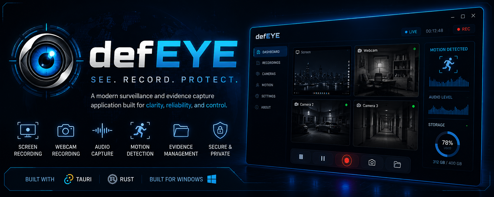
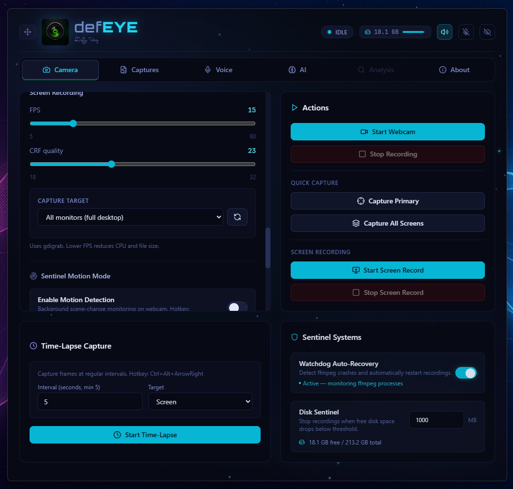

<p align="center">
  
</p>

<h1 align="center">defEYE</h1>

<p align="center">
Professional surveillance and evidence capture built with Tauri + Rust.
</p>

defEYE v1.0.0 is a local-only Tauri v2 desktop sentinel for Windows 10/11. It records webcam video and full screen video through `ffmpeg`, captures selected-primary or merged multi-monitor screenshots through `xcap`, monitors your webcam for motion, listens for voice commands, optionally analyzes captures with a local AI vision model — and stays hidden unless summoned.



---

## Table of Contents

- [Privacy](#privacy)
- [Requirements](#requirements)
- [Build & Run](#build--run)
- [Hotkeys](#hotkeys)
- [Webcam Recording](#webcam-recording)
- [Screen Recording](#screen-recording)
- [Screenshot Capture](#screenshot-capture)
- [Multi-Camera Support](#multi-camera-support)
- [Audio Control](#audio-control)
- [Camera Preview](#camera-preview)
- [Sentinel Motion Mode](#sentinel-motion-mode)
- [Stealth Mode](#stealth-mode)
- [Time-Lapse Capture](#time-lapse-capture)
- [Disk Sentinel](#disk-sentinel)
- [Sentinel Watchdog](#sentinel-watchdog)
- [Capture Vault — Retention Policy](#capture-vault--retention-policy)
- [Evidence Hardening](#evidence-hardening)
- [Captures Tab](#captures-tab)
- [Snapshot Extraction](#snapshot-extraction)
- [Capture Annotations](#capture-annotations)
- [AI Analysis (Ollama)](#ai-analysis-ollama)
- [Voice Control (Vosk)](#voice-control-vosk)
- [HUD Overlay](#hud-overlay)
- [Window Controls](#window-controls)
- [Color Themes](#color-themes)
- [Sound Effects](#sound-effects)
- [Hotkey Rebinding](#hotkey-rebinding)
- [System Tray & Autostart](#system-tray--autostart)
- [Files & Paths](#files--paths)
- [Architecture Notes](#architecture-notes)
- [Tech Stack](#tech-stack)
- [License](#license)

---

## Privacy

defEYE is strictly local. There is **no telemetry, no cloud integration, no external API calls, and no data collection**. All recording, motion detection, voice recognition, and AI analysis happens on-device. The optional Ollama integration connects only to a local Ollama instance — no images ever leave your machine.

---

## Requirements

- **Windows 10/11**
- **Rust stable** (1.77.2+)
- **Node.js + pnpm**
- **ffmpeg** installed and available in `PATH`

Install ffmpeg on Windows with one of:

```bash
winget install Gyan.FFmpeg
choco install ffmpeg
```

Verify from a new terminal:

```bash
ffmpeg -version
```

---

## Build & Run

```bash
pnpm install
pnpm tauri dev      # development (starts hidden — use hotkey to show)
pnpm tauri build    # production build
```

`pnpm tauri dev` starts hidden by design. Use the **Show Settings** hotkey (`Ctrl+Shift+ArrowDown` by default) to reveal the settings window.

Release builds are emitted under:

```text
src-tauri/target/release/defEYE.exe
```

---

## Hotkeys

All hotkeys are **fully rebindable** from the About tab. The defaults are:

| Hotkey | Action |
|---|---|
| `Shift+ArrowUp` | Start webcam recording |
| `Shift+ArrowDown` | Stop webcam recording and finalize the file |
| `Ctrl+ArrowUp` | Start screen recording (desktop via gdigrab) |
| `Ctrl+ArrowDown` | Stop any active recording (webcam or screen) |
| `Ctrl+ArrowLeft` | Capture the configured primary screen |
| `Ctrl+ArrowRight` | Capture all screens merged into one virtual-desktop PNG |
| `Ctrl+Shift+ArrowUp` | Toggle Sentinel Motion Mode on/off |
| `Ctrl+Shift+ArrowDown` | Show / focus the settings window (also toggles Stealth) |
| `Ctrl+Shift+ArrowLeft` | Cycle to the previous camera (Quick-Switch mode) |
| `Ctrl+Shift+ArrowRight` | Cycle to the next camera (Quick-Switch mode) |
| `Ctrl+Alt+ArrowUp` | Open the region selector for custom screenshot region |
| `Ctrl+Alt+ArrowRight` | Toggle Time-Lapse capture on/off |
| `Ctrl+Alt+ArrowDown` | Kill defEYE (full shutdown) |

---

## Webcam Recording

defEYE records webcam video as MP4 using ffmpeg's DirectShow (`dshow`) input on Windows. The selected camera device is passed as `video="..."` to ffmpeg, with optional audio combined in the same input.

- **Quality Presets**: Choose from Ultra (CRF 18), High (CRF 20), Medium (default, CRF 23), Low (CRF 28), or Custom (manual CRF slider, range 18–32).
- **Max Recording Duration** (seconds, 0 = unlimited): Automatically stops recordings after a configurable duration.
- **Auto-Restart**: When max duration is set, optionally restart the recording automatically after the duration is reached.
- Files are named `defEYE_webcam_YYYY-MM-DD_HH-MM-SS.mp4`.
- In multi-camera mode, files include the camera index: `defEYE_webcam_cam1_*.mp4`, `defEYE_webcam_cam2_*.mp4`, etc.
- The HUD shows `CAM` while webcam recording is active.

---

## Screen Recording

defEYE records the desktop as MP4 video using ffmpeg's `gdigrab` input:

```text
ffmpeg -f gdigrab -framerate {fps} -i desktop -vcodec libx264 -preset veryfast -crf {crf} -pix_fmt yuv420p -movflags +faststart output.mp4
```

- **FPS** (default 15, range 5–60): Controls capture framerate. Lower FPS reduces CPU usage and file size.
- **CRF** (default 23, range 18–32): Controls quality. Lower values = higher quality / larger files.
- **Capture Target**: Record the full virtual desktop (all monitors) or a specific monitor. Switching targets while recording automatically restarts the recording on the new monitor.
- Screen recording is independent from webcam recording — both can run simultaneously.
- Files are named `defEYE_screen_YYYY-MM-DD_HH-MM-SS.mp4`.
- The HUD shows `SCR` while screen recording is active, and `MIX` when both webcam and screen are recording.
- With audio enabled, ffmpeg adds a separate dshow audio input alongside the gdigrab video input and encodes it as AAC.

---

## Screenshot Capture

defEYE captures screenshots using the `xcap` crate, which provides cross-platform screen capture:

- **Capture Primary** (`Ctrl+ArrowLeft`): Captures the configured primary monitor as a PNG. Files are named `defEYE_current_YYYY-MM-DD_HH-MM-SS.png`.
- **Capture All Merged** (`Ctrl+ArrowRight`): Captures all monitors and merges them into a single virtual-desktop PNG. The merge computes min/max bounds across all monitors, creates one RGBA canvas, and copies each monitor image into the correct offset. Files are named `defEYE_allmerged_YYYY-MM-DD_HH-MM-SS.png`.

### Region Selection

Screenshots can be restricted to a specific region:

- **Full** (default): Capture the full virtual desktop.
- **Primary**: Capture only the primary monitor.
- **Custom**: Capture a rectangular region defined by X, Y, Width, and Height.

When Custom mode is selected, a **"Select Region with Mouse"** button opens a fullscreen transparent overlay where you drag to draw the desired region. The selected region is cropped from the full capture using the `image` crate's crop functionality before saving.

The region selector hotkey (`Ctrl+Alt+ArrowUp`) opens the selector instantly.

---

## Multi-Camera Support

defEYE supports multiple cameras with three modes:

### Single (default)

Standard single-camera recording using the selected device.

### Multi — Simultaneous

Records from all selected cameras at once. Each camera writes to a separate file (`defEYE_webcam_cam1_*.mp4`, `defEYE_webcam_cam2_*.mp4`, etc.). Multi-camera recordings are held in a `Vec<std::process::Child>` protected by a `parking_lot::Mutex`.

### Quick-Switch

Records from one camera at a time. Use hotkeys to cycle between cameras without stopping the recording — the current recording is stopped and a new one starts with the next camera. The active camera index is tracked with an `AtomicUsize`.

- `Ctrl+Shift+ArrowLeft`: Cycle to the previous camera.
- `Ctrl+Shift+ArrowRight`: Cycle to the next camera.
- If a recording is active when cycling, it is stopped and restarted with the new camera automatically.
- The UI shows the previous / active / next camera in a visual carousel.

### Camera Selection

In Multi or Quick-Switch mode, a checklist of detected cameras appears. Select which cameras to include. In Quick-Switch mode, the active camera is highlighted with a green border and "● active" indicator.

---

## Audio Control

defEYE provides per-source audio device selection for both webcam and screen recording. Audio devices are enumerated via `ffmpeg -list_devices true -f dshow -i dummy`, parsing lines tagged with `(audio)`.

### Webcam Audio

- **Webcam Audio Enabled** (default: on): Toggle audio capture for webcam recordings.
- **Audio Device**: Select a specific DirectShow audio input device (microphone). When selected, ffmpeg uses the combined `video=...:audio=...` dshow input syntax.
- **Legacy Audio Flag**: A fallback AAC flag when no specific audio device is chosen.
- A real-time **audio level meter** in the Camera tab shows the current input level for the selected webcam audio device.

### Screen Audio

- **Screen Audio Enabled** (default: off): Toggle audio capture for screen recordings.
- **Audio Device**: Select a specific DirectShow audio input device for screen recording audio.
- When enabled, ffmpeg adds a separate dshow audio input alongside the gdigrab video input.
- A real-time **audio level meter** shows the current input level for the selected screen audio device.

Audio level monitoring runs via the `cpal` crate, streaming live level data to the frontend through the `audio-level` event.

---

## Camera Preview

The Camera tab includes an **Activate** button that starts a live camera preview without recording. This runs a background ffmpeg process that continuously captures JPEG frames to a temporary file, which the UI polls and displays.

- **Activate / Deactivate**: Toggles the camera preview on and off.
- The preview runs independently from recording — you can preview, then start recording separately.
- The preview frame auto-refreshes every 1.5 seconds.
- The preview automatically stops when the settings window is closed or the app exits.

---

## Sentinel Motion Mode

defEYE includes an optional smart-trigger system that monitors the webcam feed for scene changes and can automatically start recording when motion is detected.

### How It Works

When Motion Mode is enabled, defEYE spawns a background ffmpeg process that reads from the selected webcam and applies the `select='gt(scene,THRESHOLD)'` filter with `showinfo` output. The background thread parses ffmpeg's stderr for `showinfo` lines indicating a scene change above the computed threshold.

### Settings

- **Motion Mode Enabled** (default: off): Master toggle for motion detection.
- **Sensitivity** (1–100, default: 50): Maps inversely to ffmpeg's scene threshold. Higher sensitivity = lower threshold = more detections. Range maps to scene threshold 0.01–0.30.
- **Cooldown** (seconds, default: 30): Minimum time between motion triggers to avoid spam.
- **Auto-record on Motion** (default: on): Automatically starts webcam recording when motion is detected (if not already recording).
- **Min Record Seconds** (default: 5): Minimum recording duration once motion triggers. The auto-stop monitor will not stop the recording before this time elapses.
- **Post-Record Seconds** (default: 15): How long to keep recording after the last motion detection event. Once no motion has been detected for this duration (and the minimum record time has elapsed), the recording is automatically stopped and finalized.
- **Motion Triggers Screen** (default: off): Also starts screen recording when motion is detected.

### Hotkey

`Ctrl+Shift+ArrowUp` toggles Motion Mode on/off instantly. This updates settings and restarts/stops the detection loop.

### HUD Indicators

- **SCAN**: Amber pulsing dot — motion detection is active and scanning.
- **MOTION**: Amber flash — motion was just detected (flashes for 2 seconds).
- **REC**: Red dot — recording is active (takes priority over scan display).

### Motion Log

All motion detections are appended to `motion_log.txt` in the output directory with timestamps:

```text
2025-01-15_14-30-22 - Motion detected
2025-01-15_14-31-05 - Motion detected
```

### Privacy

Motion Mode is 100% local. The ffmpeg process runs entirely on-device. No frames, no detection data, and no network calls are made.

---

## Stealth Mode

Stealth Mode is a one-touch toggle to instantly hide all defEYE windows (settings, HUD, region selector) from the screen.

- **Hotkey**: `Ctrl+Shift+ArrowDown` (default, rebindable) toggles stealth mode on/off.
- **Button**: A stealth icon in the header also toggles it.
- When engaged, all defEYE windows are hidden via `window.hide()`. Disengaging restores them via `window.show()`.
- The state is tracked with an `AtomicBool` and emitted to the frontend via the `stealth-toggled` event.
- Stealth toggle plays a distinct sound effect on engage/disengage.

---

## Time-Lapse Capture

defEYE supports interval-based time-lapse capture for screen, webcam, or both simultaneously.

- **Interval** (seconds, min 5, default: 10): Set the time between each capture.
- **Target**: Choose `screen` (screenshot via xcap), `webcam` (single frame via ffmpeg dshow), or `both` (screen + webcam simultaneously).
- **Hotkey**: `Ctrl+Alt+ArrowRight` toggles time-lapse on/off.
- Files are named `defEYE_timelapse_YYYY-MM-DD_HH-MM-SS.png` and organized into session folders under `timelapse/session_YYYY-MM-DD_HH-MM-SS/`.
- Each frame is post-processed (thumbnail, watermark, integrity, metadata) like any other capture.
- Status is emitted via the `timelapse-status` event and shown in the UI with an active indicator.
- Time-lapse runs in a background thread with an `AtomicBool` active flag, sleeping in 1-second increments for responsive shutdown.

### Time-Lapse Sessions in Captures Tab

Time-lapse captures are grouped by session in the Captures tab:

- **Session grouping**: Frames are displayed in a horizontal scroll strip grouped by session folder.
- **Create GIF**: Generate an animated GIF from all frames in a session using ffmpeg.
- **Delete Session**: Permanently delete all frames in a session with a confirmation dialog.
- **Open Session Folder**: Reveal the session folder in the file explorer.
- New frames animate in with a slide-in transition.

---

## Disk Sentinel

defEYE monitors disk space and automatically stops recordings when free space drops below a configurable threshold.

- **Threshold** (default: 1000 MB): Set the minimum free disk space in MB. When free space falls below this, all active recordings are stopped gracefully.
- **Check Interval**: 10 seconds — a background thread queries free disk space via the Windows `GetDiskFreeSpaceExW` API.
- **Warning Indicator**: The header shows a red disk space indicator with a usage bar when below threshold.
- **Pre-recording Check**: Before starting any recording, disk space is checked. If below threshold, the recording is refused with an error message.
- The disk info widget in the header shows free space (GB/MB) and a usage bar at all times.

---

## Sentinel Watchdog

defEYE includes a watchdog that detects ffmpeg process crashes and automatically recovers recordings.

- **Enabled** (default: on): Toggle watchdog monitoring.
- **Check Interval**: 5 seconds — a background thread checks if recording child processes are still alive via `try_wait()`.
- If a webcam or screen recording process has exited unexpectedly, the watchdog automatically restarts the recording with the same settings.
- Recovery events are logged and emitted to the frontend.
- The Camera tab shows a live "Active — monitoring ffmpeg processes" indicator when enabled.

---

## Capture Vault — Retention Policy

defEYE can automatically purge old captures based on configurable age, count, and size limits.

- **Retention Enabled** (default: off): Master toggle for auto-cleanup.
- **Max Age** (days, default: 30, 0 = unlimited): Captures older than this are deleted.
- **Max Count** (default: 0 = unlimited): When exceeded, the oldest captures are deleted first.
- **Max Size** (GB, default: 0 = unlimited): When total capture size exceeds this, oldest captures are deleted first.
- **Check Interval**: 300 seconds (5 minutes) — a background sentinel thread runs the purge.
- **Purge Now**: A manual button triggers immediate cleanup and reports how many files were removed.
- All constraints are applied simultaneously — the most restrictive wins.

---

## Evidence Hardening

defEYE includes chain-of-custody evidence hardening features:

### Text Watermarking

- **Watermark Enabled** (default: off): Embeds a "defEYE {timestamp}" watermark on captures.
- For video recordings: Uses ffmpeg's `drawtext` filter during encoding, with the system Arial font.
- For PNG screenshots: Pixel-level watermark is applied post-capture using the `image` crate.

### Image Watermarking

- **Image Watermark Enabled** (default: off): Overlays a custom image (PNG/JPG/BMP/WebP) on captures.
- **Opacity** (0–100%): Controls the transparency of the overlay image.
- **Scale** (1–100%): Controls the size of the overlay relative to the capture.
- **Position**: Top Left, Top Right, Bottom Left, Bottom Right, Center, or Custom (manual X/Y pixel offsets).
- A file browser dialog lets you pick the watermark image from disk.

### Metadata Embedding

- **Embed Metadata** (default: off): Adds metadata to capture files.
- For video: ffmpeg `-metadata` flags embed title and comment tags in the MP4 container.
- For all files: A `*.meta.json` sidecar file is written with capture metadata (file name, kind, timestamp, tool, version).

### Integrity Check (SHA256)

- **Integrity Check** (default: off): Computes a SHA256 hash of the capture file and stores it in a `*.sha256.json` sidecar.
- The sidecar contains the file name, SHA256 hash, and timestamp.
- The Captures tab includes a **Verify** button that recomputes the hash and compares it against the stored sidecar to detect tampering.
- SHA256 hashing uses the `sha2` crate.

---

## Captures Tab

The Captures tab provides a comprehensive view of all recent captures (up to 100 listed):

- **Thumbnails**: Auto-generated preview thumbnails for both PNG and MP4 files. PNG thumbnails are generated using the `image` crate; video thumbnails are extracted via ffmpeg at the 1-second mark.
- **Integrity Badges**: Shield icons indicate which captures have integrity sidecars (green) or watermarks (blue).
- **Annotation Badges**: Sticky note icons indicate which captures have annotation sidecars.
- **Preview Modal**: Click the eye icon to open a full-size preview — video files play in an embedded video player with controls; images display full-size. A **Snap Frame** button on video previews extracts a still frame at the current playback position.
- **Verify Button**: Run on-demand SHA256 integrity verification directly from the captures table. Results show stored vs. actual hash with a pass/fail indicator.
- **Open / Reveal**: Open captures in the default application or reveal them in the file explorer.
- **Delete**: Delete individual captures with confirmation.
- **File Count & Size**: The header shows total file count and aggregate size.
- **Duration Column**: Video captures display their duration in `M:SS` or `H:MM:SS` format.
- **Marquee Filenames**: Long filenames scroll horizontally on hover for readability.

---

## Snapshot Extraction

defEYE can extract a still frame from any video recording at a specified timestamp.

- Available from the Captures tab — the **Snap Frame** button in the video preview modal captures a frame at the current playback position.
- ffmpeg seeks to the specified time with `-ss` and extracts a single frame with `-frames:v 1`.
- Files are named `defEYE_snapshot_YYYY-MM-DD_HH-MM-SS.png`.
- The extracted snapshot is post-processed like any other capture (thumbnail, watermark, integrity, metadata).

---

## Capture Annotations

defEYE supports adding text notes to any capture via sidecar JSON files.

- Available from the Captures tab — a sticky note button opens the annotation editor modal.
- Notes are stored as `*.note.json` sidecar files alongside the capture, containing `{file, note, timestamp}`.
- A sticky note badge in the captures table indicates which captures have annotations.
- Setting an empty note clears the sidecar file.

---

## AI Analysis (Ollama)

defEYE integrates with [Ollama](https://ollama.ai) for local, on-device vision-based analysis of captures. No images leave your machine.

### Setup

1. Install Ollama and pull a vision-capable model: `ollama pull qwen2.5vl:7b`
2. In the **AI tab**, enable Ollama Integration.
3. Set the endpoint (default: `http://localhost:11434`) and click **Test** to verify connectivity.
4. Select a model from the dropdown or click **Auto-detect** to list installed models.

### Supported Models

- `qwen2.5vl:7b` (recommended — fast, compatible with Ollama 0.30+)
- `qwen2.5vl:3b` (lightweight)
- `qwen2.5vl:32b` (high quality)
- `gemma3:12b`
- `llava`
- Any other vision model installed in your local Ollama instance

### Analysis Tab

The Analysis tab (enabled when Ollama is active) provides:

- **Capture Browser**: Search and select from all recent captures with thumbnail previews.
- **Prompt Input**: Free-text prompt with quick presets: Security, Timeline, Transcribe, Detect, Describe.
- **Run defEYE Analysis**: Sends the selected capture to Ollama with your prompt and the configured system prompt.
- **Analyze Last Motion Clip**: Automatically analyzes the most recent `defEYE_webcam_*.mp4` capture.
- **Results Display**: Shows metadata (file, captured time, resolution, size, confidence, source), tags, summary text, key observations, and a collapsible raw model response.
- **Copy to Clipboard**: Tags, summary, and observations can be copied individually.

### Advanced Settings

- **Temperature** (0–1, default: 0.3): Controls model creativity.
- **Max Tokens** (64–8192, default: 1024): Limits response length.
- **System Prompt**: Fully customizable — defaults to a security-focused sentinel prompt that outputs structured JSON.
- **Auto-Analysis on Capture** (default: off): Automatically runs analysis with a default prompt when a capture is saved.

---

## Voice Control (Vosk)

defEYE includes fully offline voice recognition using [Vosk](https://alphacephei.com/vosk/), loaded dynamically at runtime via `libvosk.dll` — no link-time dependency. If the DLL is not present, voice features are simply unavailable.

### Setup

1. Download a Vosk model from [alphacephei.com/vosk/models](https://alphacephei.com/vosk/models) (e.g., `vosk-model-small-en-us-0.15`).
2. In the **Voice tab**, set the **Vosk Model Path** to the extracted model folder.
3. Select a **Microphone Source** (or use the system default).
4. Click **Start Listening** to begin voice recognition.

### Recognition Settings

- **Confidence Threshold** (10–99%, default: 65%): Controls how strictly spoken phrases must match configured commands. Lenient allows misheard words; Strict requires exact matches.
- **Wake Word** (optional): When set, all commands must be prefixed with the wake word (e.g., say "defeye sentinel engage" instead of just "sentinel engage"). A lock-in button confirms the wake word.
- **Voice Feedback (TTS)** (default: on): Speaks a confirmation after each command is executed.
- **Auto-Start on Launch** (default: off): Begin listening automatically when defEYE starts.

### Command Phrases

Voice commands map spoken phrases to defEYE actions. Commands are fully customizable:

- **Add / Remove**: Add new command phrases or remove existing ones.
- **Reorder**: Drag-and-drop rows by the grip handle, or use up/down arrow buttons.
- **Edit**: Change the spoken phrase text or the mapped action.

### Voice Actions

| Action | Description |
|---|---|
| Start Webcam | Start webcam recording |
| Stop Recording | Stop any active recording |
| Capture Primary | Take a primary screen screenshot |
| Capture All Merged | Capture all monitors merged |
| Toggle Motion | Toggle Sentinel Motion Mode |
| Disable Motion | Turn off Motion Mode |
| Toggle Stealth | Toggle Stealth Mode |
| Start Screen Recording | Start screen recording |
| Stop Screen Recording | Stop screen recording |
| Stop All & Disable Motion | Stop everything and disable motion |
| Start Time-Lapse | Begin time-lapse capture |
| Stop Time-Lapse | Stop time-lapse capture |
| Cycle Camera Left | Switch to previous camera |
| Cycle Camera Right | Switch to next camera |
| Capture Region | Open the region selector |
| Open Output Folder | Open the output directory |
| Show Settings | Show/focus the settings window |

### Voice Command Themes

defEYE ships with **15 preset themes** for command phrases, plus two custom slots:

- **Gamer (Default)**: "press start", "game over", "screenshot", "panorama", "enable radar", "stealth mode", "co-op mode", "quit to menu", "open inventory"
- **Sentinel**: "sentinel engage", "close the eye", "eye capture", "wide perimeter", "activate scan", "stand down", "full alert"
- **Standard**: "start recording", "stop recording", "take screenshot", "capture all screens", "turn on motion", "record screen"
- **Minimal**: "start", "stop", "capture", "settings"
- **Cinematic**: "action", "cut", "still shot", "wide shot", "rolling", "that's a wrap", "stealth cam", "time lapse"
- **Sci-Fi**: "initialize eye", "terminate ocular", "snapshot", "panopticon", "engage cloak", "temporal capture", "scan perimeter"
- **Marine Corps**: "weapons hot", "cease fire", "snap recon", "overwatch", "radar on", "go dark", "full barrage", "stand down all"
- **Obscure**: "yo", "nah", "snap", "yoink", "shh", "vroom", "brake", "nvm", "home", "yolo", "lefty", "righty"
- **Pirate**: "raise the mast", "drop anchor", "spyglass", "wide horizon", "man the crow's nest", "go below deck", "fire the cannons", "abandon ship"
- **Medical**: "code blue", "code clear", "chart snapshot", "full scan", "activate monitors", "quiet mode", "code red", "code black"
- **Chef**: "fire the oven", "turn off the burners", "plate it", "full spread", "watch the grill", "close the kitchen", "fire up the second station"
- **Aviator**: "cleared for takeoff", "cleared to land", "mark position", "wide area photo", "activate radar", "go dark", "engage second engine", "mayday mayday"
- **Detective**: "open the case", "case closed", "take evidence", "crime scene wide", "start surveillance", "go undercover", "wire the second room", "close all cases"
- **Wizard**: "open the eye", "close the eye", "capture vision", "all-seeing eye", "detect motion", "cast invisibility", "summon second eye", "dispel all magic", "open the grimoire"
- **Custom**: Start from scratch — no preset commands.
- **Custom 2**: A second blank slate for custom commands.

### Command Log

A live command log shows the most recent 20 recognized commands with timestamps. The log can be cleared at any time.

### Live Transcript

While voice control is active, a live transcript bar shows the current partial recognition result in real time.

---

## HUD Overlay

defEYE creates a separate `hud` window during setup:

- **Transparent, borderless, always on top**, skipped from the taskbar.
- About 118×28 px, click-through where the OS/runtime supports it.
- Default position: top-right corner of the primary monitor. Configurable to any corner or hidden entirely.
- **Minimal Mode**: Reduces the HUD to a compact dot-only indicator with no text label.
- Shows contextual status with color-coded dots:
  - **Green dot — IDLE**: No recording or motion active.
  - **Red dot — CAM / SCR / MIX**: Recording active (webcam / screen / mixed).
  - **Amber pulsing dot — SCAN**: Motion detection is active.
  - **Amber flash — MOTION**: Motion was just detected (flashes for 2 seconds).
  - **Amber dot — SAVE**: Recording is being finalized.
  - **Sky blue pulsing dot — VOICE**: Voice control is listening.

---

## Window Controls

The main settings window uses `decorations(false)` — no native title bar. Instead:

- **Drag Handle**: A cross icon in the header lets you click and drag to move the window via `getCurrentWindow().startDragging()`.
- **SFX Toggle**: A speaker icon in the header toggles sound effects on/off.
- **Voice Toggle**: A microphone icon in the header toggles voice control on/off.
- **Stealth Toggle**: An eye-off icon in the header toggles Stealth Mode.
- **Status Pill**: Shows `REC WEBCAM`, `REC SCREEN`, `SAVING`, or `IDLE` with a color-coded pulsing dot.
- **Recording Duration**: A live `MM:SS` timer appears in the header while recording.
- **Disk Space Indicator**: Shows free disk space with a usage bar; turns red when below threshold.
- Closing the settings window hides it and keeps the process running. Use the hotkey to show it again.

---

## Color Themes

defEYE ships with three color themes, selectable from the About tab:

- **Sentinel** (default): Emerald dark UI with a subtle grid background.
- **Amber Tactical**: Warm amber-on-charcoal palette with an animated radar sweep and floating ember particles.
- **CosmoTech™**: Cosmic cyan-violet palette with an animated particle network background (70 particles with proximity-linked lines and radial glow).

Themes are persisted to `localStorage` and applied via CSS custom properties on `:root`.

---

## Sound Effects

defEYE includes a built-in sound effects system with 15 distinct audio cues:

- **Recording start/stop**: Different sounds for webcam vs. screen recording start and stop.
- **Capture**: Distinct sounds for primary screen capture vs. all-screens capture.
- **Sentinel Motion Mode**: Played when motion mode is enabled.
- **Time-Lapse**: Played when time-lapse starts.
- **Stealth**: Distinct sounds for stealth on/off.
- **Button clicks**: Subtle click sounds for header and general button interactions.
- **Trash**: Played when deleting a capture.
- **SFX Toggle**: Played when toggling the SFX system itself.
- **Terminate**: Played when killing defEYE.

SFX can be toggled on/off from the header speaker icon. The preference is persisted to `localStorage`. Each sound has an individually tuned volume level.

---

## Hotkey Rebinding

All hotkeys are fully rebindable from the About tab:

- Click any hotkey button to enter capture mode — press a key combination to bind it.
- Press `Escape` to cancel rebinding.
- The **Stealth** hotkey is featured prominently at the top with an amber highlight.
- The **Kill defEYE** hotkey is highlighted in red.
- A **Reset to Default** button restores all hotkeys to their factory defaults with confirmation.
- Hotkey changes are persisted to `defeye_settings.json` and applied immediately via the Tauri global shortcut plugin.

Shortcuts are displayed with arrow symbols (↑ ↓ ← →) for readability.

---

## System Tray & Autostart

- **Autostart**: defEYE enables Windows autostart on first successful launch via `tauri-plugin-autostart`.
- **System Tray**: A system tray icon provides quick access to show/hide the settings window. If the tray icon is removed, it can be restored from the About tab.
- The main settings window is created hidden, borderless, and skipped from the taskbar by default.

---

## Files & Paths

### Output Directory

Default:

```text
%USERPROFILE%\Documents\defEYE\
```

Configurable from the Camera tab → Output Directory.

### Config File

```text
app_local_data_dir()/defeye_settings.json
```

Contains all settings: camera devices, audio devices, motion parameters, hotkey bindings, voice commands, Ollama configuration, watermark settings, etc.

### Capture File Naming

```text
defEYE_webcam_YYYY-MM-DD_HH-MM-SS.mp4              # webcam recording
defEYE_webcam_cam1_YYYY-MM-DD_HH-MM-SS.mp4          # multi-camera (camera 1)
defEYE_webcam_cam2_YYYY-MM-DD_HH-MM-SS.mp4          # multi-camera (camera 2)
defEYE_screen_YYYY-MM-DD_HH-MM-SS.mp4               # screen recording
defEYE_current_YYYY-MM-DD_HH-MM-SS.png              # primary screen screenshot
defEYE_allmerged_YYYY-MM-DD_HH-MM-SS.png            # all monitors merged screenshot
defEYE_timelapse_YYYY-MM-DD_HH-MM-SS.png            # time-lapse frame
defEYE_snapshot_YYYY-MM-DD_HH-MM-SS.png             # extracted video snapshot
motion_log.txt                                      # motion detection log
thumbnails/                                          # auto-generated thumbnails
timelapse/session_YYYY-MM-DD_HH-MM-SS/              # time-lapse session folders
timelapse/session_*/timelapse.gif                   # generated time-lapse GIFs
*.sha256.json                                       # SHA256 integrity sidecars
*.meta.json                                         # metadata sidecars
*.note.json                                         # annotation sidecars
*.watermark.json                                    # watermark sidecars
```

---

## Architecture Notes

- **No tray plugin dependency**: System tray is managed natively.
- The main settings window is created hidden, borderless, and skipped from the taskbar.
- Closing settings hides the window and keeps the process running.
- **Autostart** is enabled on first successful launch.
- Active webcam recording is held as `Arc<parking_lot::Mutex<Option<std::process::Child>>>`.
- Active screen recording is held as a separate `Arc<parking_lot::Mutex<Option<std::process::Child>>>`.
- Multi-camera recordings are held in a `Vec<std::process::Child>` protected by `parking_lot::Mutex`.
- `recording_kind` is computed dynamically: `"screen"` takes priority over `"webcam"` when both are active; `"mixed"` when both are active.
- Screenshot merge uses virtual monitor coordinates, computes min/max bounds, creates one RGBA canvas, and copies every monitor image into the correct offset.
- Settings are serialized to `defeye_settings.json` in the app local data directory.
- Motion detection runs as a separate ffmpeg process with `select` + `showinfo` filter, parsed in a background thread.
- Motion state is tracked with `AtomicBool` for the active flag and `Mutex<Option<Instant>>` for last detection time (cooldown).
- Motion detection is gracefully stopped via `q` on stdin + `kill()` on app exit or toggle off.
- Motion-triggered recordings reuse the same `recording_child` and `screen_recording_child` mutexes as manual recordings.
- Evidence hardening post-processing runs after recording stops: integrity sidecar, metadata sidecar, and thumbnail generation.
- SHA256 hashing uses the `sha2` crate for integrity verification.
- Camera cycling in Quick-Switch mode updates `active_camera_index` (`AtomicUsize`) and restarts recording if active.
- All child processes are gracefully stopped via a shared `graceful_stop_child` helper (stdin `q` + wait).
- Camera preview runs a separate ffmpeg process capturing JPEG frames to a temp file, polled by the frontend.
- Motion auto-stop monitor thread checks recording status every second and stops after post-record timeout.
- The `StatusPill` in the UI shows a live elapsed timer during recording using a React interval.
- The Captures tab header shows total file count and aggregate size.
- The About tab includes a keyboard shortcut reference card with rebinding, capture statistics, color theme picker, and an interactive particle toy.
- Window dragging uses `getCurrentWindow().startDragging()` on mouse down via the cross icon in the header.
- Stealth mode toggles window visibility via `window.hide()` / `window.show()` for all defEYE windows.
- Disk sentinel uses `GetDiskFreeSpaceExW` from the Windows API (`Win32_Storage_FileSystem` feature).
- Watchdog monitors recording child processes via `try_wait()` and auto-restarts with the same settings.
- Retention sentinel sorts captures by creation time and deletes oldest first to satisfy constraints.
- Time-lapse runs in a background thread with an `AtomicBool` active flag, sleeping in 1-second increments for responsive shutdown.
- Snapshot extraction uses ffmpeg with `-ss` seek and `-frames:v 1` for single-frame extraction.
- Capture annotations are stored as `*.note.json` sidecars with `{file, note, timestamp}` structure.
- Voice recognition uses Vosk loaded dynamically via `libloading` — no link-time dependency. If `libvosk.dll` is not found, voice features are gracefully unavailable.
- Audio level monitoring uses the `cpal` crate to stream real-time input levels to the frontend.
- Vosk DLL search order: next to executable (portable mode) → Tauri resource directory → `resources/` subdirectory → nested resource path → system PATH.

---

## Tech Stack

### Frontend

- **React 18** + **TypeScript**
- **Tailwind CSS 3** for styling
- **Vite 5** for bundling
- **Lucide React** for icons
- **Sonner** for toast notifications
- **date-fns** for date formatting

### Backend

- **Tauri v2** (Rust) for the desktop framework
- **ffmpeg** for video recording, screen recording, snapshot extraction, and time-lapse GIF creation
- **xcap** for cross-platform screen capture
- **image** crate for PNG/JPEG processing, thumbnail generation, watermarking, and cropping
- **sha2** for SHA256 integrity hashing
- **parking_lot** for efficient mutexes
- **cpal** for real-time audio level monitoring
- **libloading** for dynamic Vosk DLL loading
- **reqwest** for Ollama API calls (local only)
- **windows** crate for `GetDiskFreeSpaceExW` disk space queries
- **tauri-plugin-autostart** for Windows autostart
- **tauri-plugin-global-shortcut** for hotkey management
- **tauri-plugin-dialog** for file/folder dialogs
- **tauri-plugin-shell** for opening URLs and files

### Bundled Resources

- **libvosk.dll** and its dependencies (`libgcc_s_seh-1.dll`, `libstdc++-6.dll`, `libwinpthread-1.dll`) are bundled as Tauri resources for voice control.

---

## License

Personal use. See project files for details.

---

**defEYE v1.0.0** — *The Unblinking Sentinel*
By [Deffy Urz](https://deffy.me)
